# Importing and exporting products — admin guide

Add, update and review **hundreds of products at once** from an Excel file, instead of editing them one by one.
You can export your catalogue to Excel, change it there, and import it back; or start from a blank template.

> Developers: see [DEVELOPER.md](DEVELOPER.md). Example files to practise with are in [`examples/`](examples/).

**In this guide**
[Who can do what](#who-can-do-what) · [Quick start](#quick-start) · [Export](#exporting-products) · [Template](#the-template) ·
[Import step by step](#importing-products-step-by-step) · [Update existing products](#updating-existing-products) ·
[Column reference](#column-reference) · [Rules](#rules-worth-knowing) · [Large files](#large-files) · [History](#import-history) ·
[Fixing errors](#fixing-errors) · [FAQ](#faq) · [Example files](#example-files)

---

## Who can do what

| | Admin | Staff |
|---|:---:|:---:|
| Export products (all, filtered or selected) | ✅ | ✅ |
| Download the template | ✅ | ✅ |
| Import products (upload, confirm, discard) | ✅ | — |
| See import history and error reports | ✅ | — |

Staff see only the **Export** and **Download template** buttons.

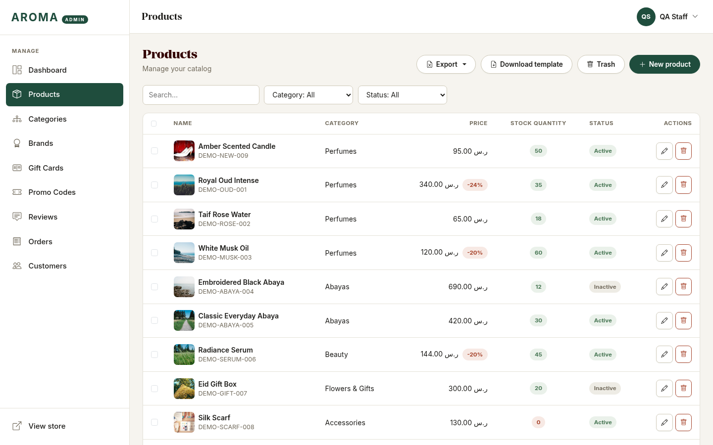

If a staff member types an import address directly, they get the standard **403 – This action is unauthorized** page and nothing happens.

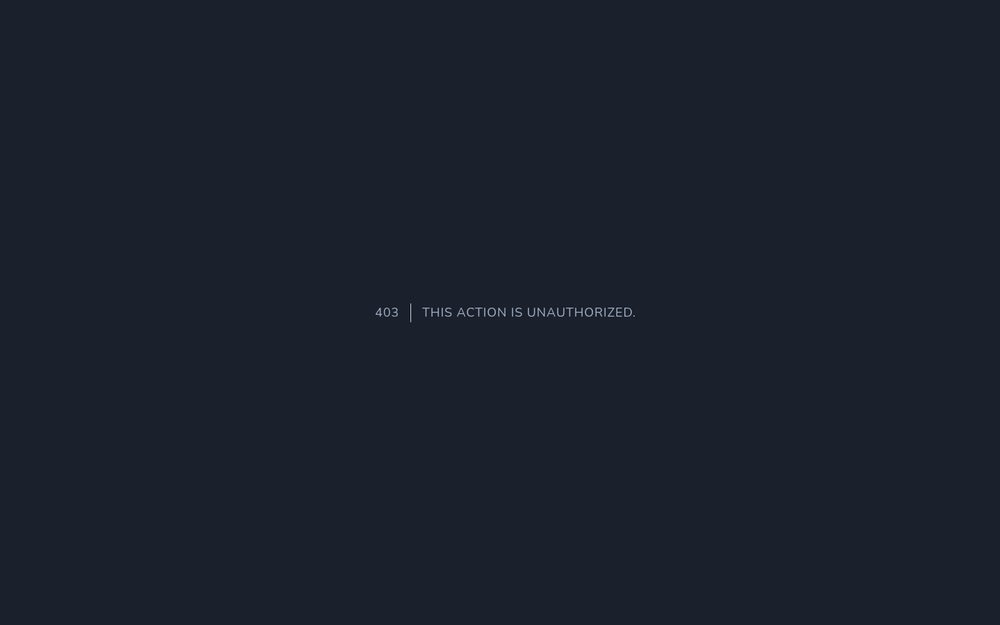

*Your developer can change who may do what in one place (`config/aroma.php` → `admin.abilities`).*

---

## Quick start

1. **Products → Download template.** Open it in Excel.
2. Fill in **one row per product**. Only five things are needed for a new product: **SKU, Arabic name, English name, Category, Price.**
3. **Products → Import products**, choose your file, press **Upload and check file**.
4. Fix anything the page lists (it tells you the exact row and column), upload again.
5. When the page says **Ready to import**, press **Confirm import**. Everything is saved together — or, if anything goes wrong, **nothing** is.

---

## Exporting products

On **Products**, open the **Export** menu:

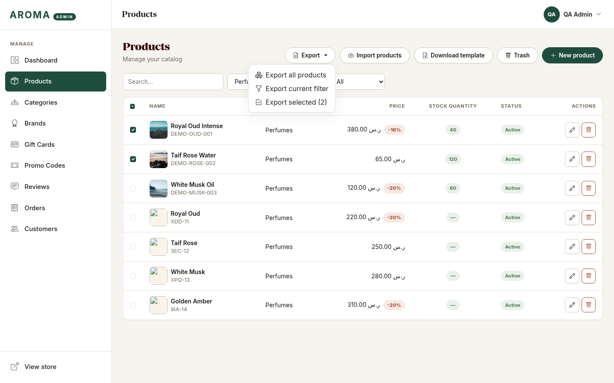

| Choice | What you get |
|---|---|
| **Export all products** | Every product in the shop (products in the Trash are not included). |
| **Export current filter** | Only the products your search / category / status filter currently shows. This item appears when a filter is active. |
| **Export selected (N)** | Only the products you ticked in the first column. Tick the box in the header to select the whole page. |

The file (`aroma-products-YYYYMMDD-HHMMSS.xlsx`) contains **all the columns listed below**, including both languages, the SEO
fields and image links. It can be edited and **imported straight back** — importing an untouched export changes nothing.
See a sample in [`examples/example-export.xlsx`](examples/example-export.xlsx).

---

## The template

**Products → Download template** gives you a workbook with three sheets:

| Sheet | Purpose |
|---|---|
| **Products** | The header row (keep the headings as they are) and three example rows. Required headings have a lighter (sand) background than the rest; hover a heading for its help note; *Status* and the yes/no columns have drop-downs. |
| **Instructions** | How to fill it in, in English with an Arabic summary. |
| **Reference** | The **current** categories and brands of your shop with their IDs, and the allowed values. |

The three example rows have SKUs starting with `EXAMPLE-`. Delete them (or keep them — they import as **inactive**, hidden
products and the checker will warn you that they look like examples).

---

## Importing products step by step

### 1. Upload

**Products → Import products.** Choose the `.xlsx` file (up to 10 MB).

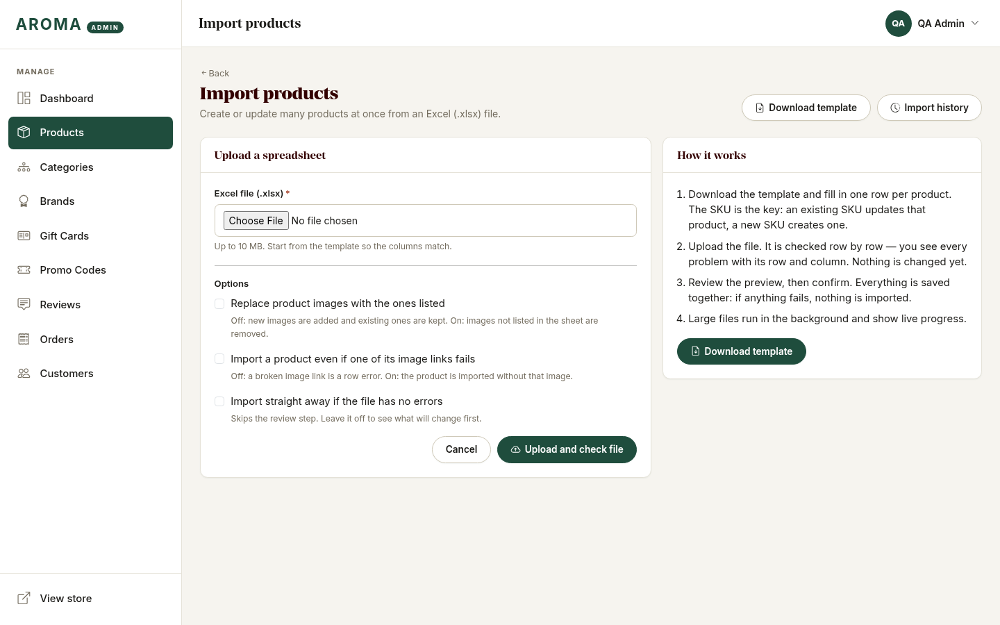

Three optional switches:

| Option | Off (default) | On |
|---|---|---|
| **Replace product images with the ones listed** | New images are *added*; existing images are kept. | Images that are not listed in the sheet are removed, and the order follows the sheet. |
| **Import a product even if one of its image links fails** | A broken image link is an error for that row. | The product is imported without that image (you get a warning). |
| **Import straight away if the file has no errors** | You review, then confirm. | Skips the review step. |

### 2. The file is checked — nothing changes yet

Every row is checked. If there are problems, the page lists **each one with its row, column, message and the value that caused it**:

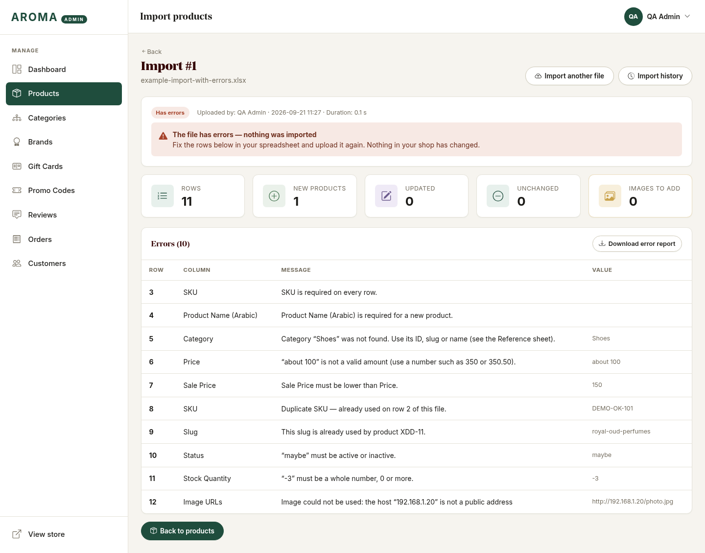

- **Row** is the row number you see in Excel.
- Nothing has been imported, so you can fix the file and upload it again. **Download error report** gives you the full list as a spreadsheet
  (handy when there are many).
- If the file has even one error, no product is created or changed.

### 3. Review

When the file is valid you see what *will* happen:


| Card | Meaning |
|---|---|
| **New products** | SKUs that don't exist yet — they will be created. |
| **Updated** | Existing SKUs where at least one value differs — they will be changed. |
| **Unchanged** | Existing SKUs where the sheet matches the shop already — nothing to do. |
| **Images to add** | New images that were downloaded during the check and will be attached. |

Yellow **warnings** (if any) are things worth a look but not blockers — for example, a product with variants whose stock cell was ignored.

Press **Confirm import** to go ahead, or **Discard** to throw the upload away.

### 4. Done

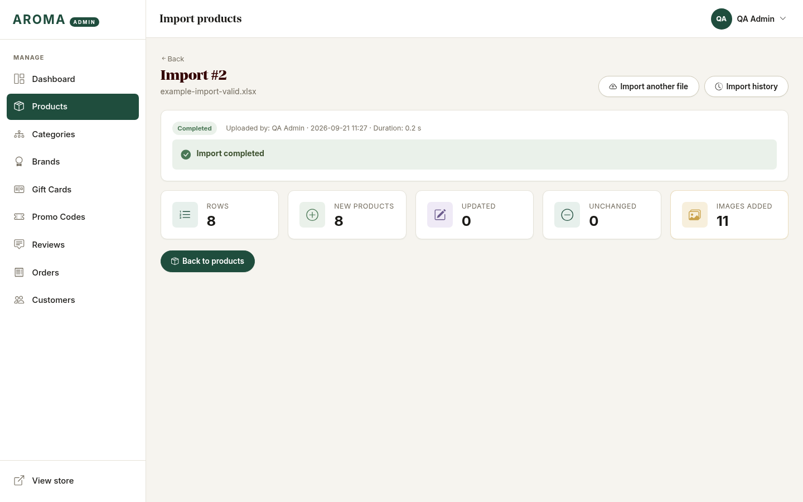

The page shows the totals and the products are live in **Products**. The run stays in [Import history](#import-history).

---

## Updating existing products

The **SKU is the key.** A row whose SKU already exists **updates** that product; an unknown SKU **creates** a new one. You can mix both in one file.

The safest way to bulk-edit: **export → change the cells you want → import.**

Because of the "blank means unchanged" rule below, an *update* file can be tiny — just the SKU and the columns you want to change:

| SKU | Sale Price | Stock Quantity |
|---|---|---|
| DEMO-OUD-001 | 340 | 35 |
| DEMO-ROSE-002 | | 18 |

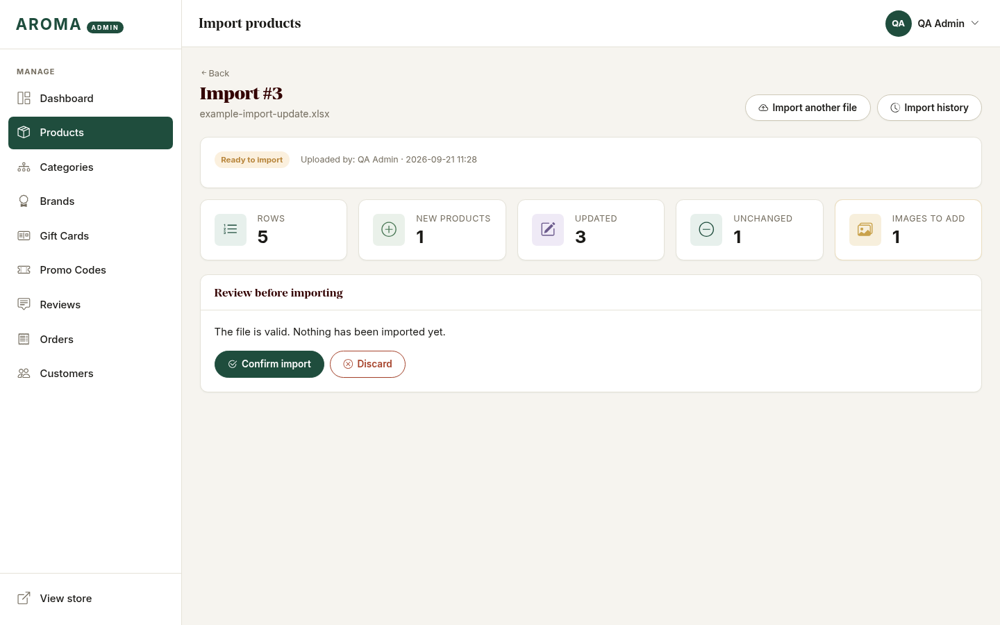

[`examples/example-import-update.xlsx`](examples/example-import-update.xlsx) is exactly this kind of file (it updates the products created by
`example-import-valid.xlsx`, removes a sale with `[clear]`, and adds one new product).

---

## Column reference

Columns can be in any order and optional columns can be left out completely. Headings are matched loosely (capital letters,
spacing and punctuation don't matter), and Arabic headings such as `رمز المنتج` (SKU) are understood too.

| # | Column heading | Needed for a new product | What to enter | Example |
|---|---|---|---|---|
| 1 | **SKU** | **Yes** | Unique product code. This is the key: an existing SKU updates that product, an unknown SKU creates a new one. | `DEMO-OUD-001` |
| 2 | **Product Name (Arabic)** | **Yes** | Arabic product name (max 255 characters). | `عود ملكي فاخر` |
| 3 | **Product Name (English)** | **Yes** | English product name (max 255 characters). | `Royal Oud Intense` |
| 4 | **Description (Arabic)** | No | Full Arabic description. Plain text; line breaks are kept. | `عطر عود شرقي فاخر…` |
| 5 | **Description (English)** | No | Full English description. Plain text; line breaks are kept. | `A rich oriental oud perfume…` |
| 6 | **Short Description (Arabic)** | No | One or two sentences shown on listings. Also the fallback meta description. | `عود شرقي فاخر يدوم طويلاً` |
| 7 | **Short Description (English)** | No | One or two sentences shown on listings. Also the fallback meta description. | `Long-lasting premium oud` |
| 8 | **Category** | **Yes** | Category ID, slug, or name (Arabic or English). See the Reference sheet. | `Perfumes  (or العطور, or 1, or perfumes)` |
| 9 | **Price** | **Yes** | Regular price in SAR (e.g. 350 or 350.50). If a Sale Price is set, this is the price shown struck through. | `450` |
| 10 | **Sale Price** | No | Optional discounted price in SAR; must be lower than Price. It becomes the price customers pay. Write [clear] to remove an existing sale. | `380` |
| 11 | **Stock Quantity** | No | Whole number, 0 or more. Products that have variants keep stock per variant, so this is ignored for them. | `40` |
| 12 | **Status** | No | "active" (visible in the shop) or "inactive" (hidden). New products default to active. | `active` |
| 13 | **Meta Title (Arabic)** | No | Browser/Google title on the Arabic page (max 255, ~60 recommended). Blank = "product name — brand". | `عود ملكي فاخر \| عطور أروما` |
| 14 | **Meta Title (English)** | No | Browser/Google title on the English page (max 255, ~60 recommended). | `Royal Oud Intense Perfume \| Aroma` |
| 15 | **Meta Description (Arabic)** | No | Google snippet on the Arabic page (max 500, ~155 recommended). | `تسوقي عود ملكي فاخر من أروما…` |
| 16 | **Meta Description (English)** | No | Google snippet on the English page (max 500, ~155 recommended). | `Shop Royal Oud Intense by Aroma…` |
| 17 | **Meta Keywords** | No | Comma-separated keywords (max 1000 characters). | `oud, royal oud, عود` |
| 18 | **Slug** | No | URL part: lowercase letters, numbers and hyphens. Blank on a new product = generated from the English name. Must be unique. | `royal-oud-intense` |
| 19 | **Featured** | No | yes / no. Featured products are highlighted on the homepage. | `yes` |
| 20 | **Sort Order** | No | Whole number. 1 is shown first in category listings, then 2, 3…; leave 0 for products you do not rank (they follow the ranked ones, newest first). | `1` |
| 21 | **Image URLs** | No | Public http(s) image links separated by \| (or a new line). The first is the main image. Images are downloaded and stored on your site. | `https://…/oud-1.jpg \| https://…/oud-2.jpg` |
| 22 | **Brand** | No | Optional. Brand ID, slug, or name. See the Reference sheet. | `Maison Riyadh` |
| 23 | **New Arrival** | No | yes / no. Shown in the "New arrivals" section. | `yes` |
| 24 | **Gift Eligible** | No | yes / no. Whether the product can be sent as a gift. New products default to yes. | `yes` |
| 25 | **Scent Family** | No | Optional, perfumes only (e.g. Oud, Musk, Floral). | `Oud` |

**Product form:** *Sort Order* and *Meta Keywords* are also on the product edit page (SEO section), so what you import can be edited by hand later.

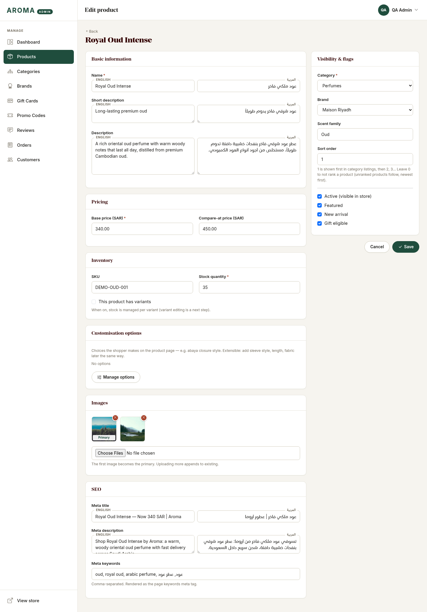

---

## Rules worth knowing

**Blank cell = leave it alone.** On an existing product an empty cell (or a column you left out) changes nothing. To actually *empty* an
optional field, type **`[clear]`** in the cell (for example `[clear]` in *Sale Price* ends a sale; in *Image URLs* removes all images). Required fields (names,
category, price) can't be cleared.

**Price and Sale Price.**
*Price* is the normal price. *Sale Price* is what customers actually pay and must be **lower** than Price.
On the shop, the sale price is shown and the normal price is struck through. Leave *Sale Price* empty for no sale. Numbers can be written
`350`, `350.50`, `1,200.50`, `350 SAR` or with Arabic digits `٣٥٠`.

**Category and Brand** can be written as the **name** (Arabic or English), the **ID** or the **slug** — see the *Reference* sheet.
They must already exist; the import never creates categories or brands.

**Slug (the web address).** Leave it empty on new products and it's created from the English name (`Royal Oud Intense` → `royal-oud-intense`;
`-2`, `-3` is added if that's taken). If you type one, it must be unique — a slug already used by another product is an error.
Changing the slug of an existing product changes its web address (you'll get a warning).

**Images.** Put full web links (`https://…`), separated by `|` or a new line, up to 10 per product; the **first is the main image**.
The import downloads and stores them on your site. Links must be public pictures (JPG, PNG, WebP, GIF, up to 5 MB) on a normal web address —
links to private/internal addresses and SVG files are refused. Importing an **export** doesn't download anything again: your own image links are recognised.

**SEO fields.** *Meta Title* and *Meta Description* appear on the shop pages (browser tab, Google results) in the matching language;
if you leave the Meta Title empty the page keeps using "product name — brand". Good lengths: title about 60 characters, description about 155.
*Meta Keywords* is a comma-separated list. Check the result on the shop:

```html
<title>Royal Oud Intense Perfume | Aroma</title>
<meta name="description" content="Shop Royal Oud Intense by Aroma: a warm, woody oriental oud perfume…">
<meta name="keywords" content="oud, royal oud, arabic perfume, عود, عطر عود">
```

**Sort Order.** In category pages, products with a number appear first in that order (1, then 2, then 3…); products left at 0 follow, newest first.

**Products with variants** (sizes/options) keep stock per variant — the *Stock Quantity* cell is ignored for them (with a warning). Variants are never changed by an import.

**SKU that looks like a number.** If your SKUs have leading zeros (`00123`), format the SKU column as **Text** in Excel before typing, or Excel will turn it into `123`.

**Both languages.** *Product Name* in Arabic **and** English is needed for new products, just like the product form. For existing products you can update one language at a time.

---

## Large files

Files with more than **100 rows**, or more than **25 images to download**, are processed in the background so the page doesn't hang.
You'll see the progress live:

| Waiting for the server | Checking |
|---|---|
| 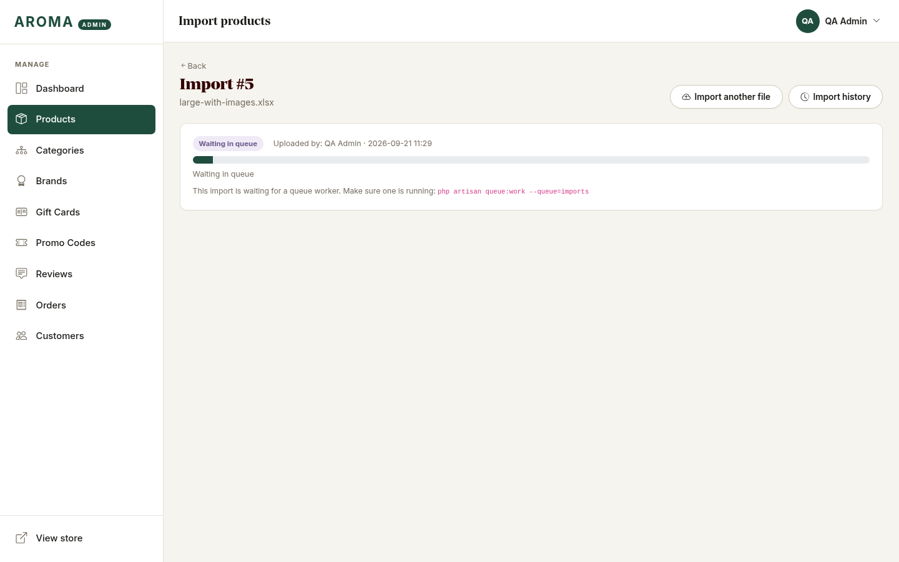 | 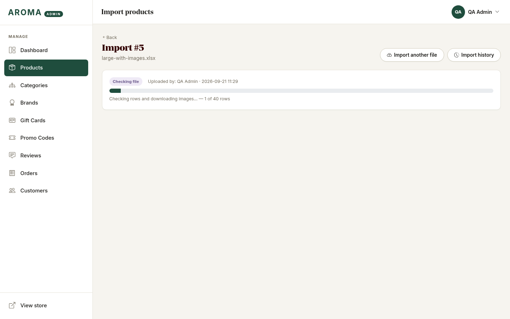 |

You can leave the page and come back — the run is in the [history](#import-history). Confirming a very large file (over 500 rows) is also processed in the background.

> **"Waiting in queue" for a long time?** Background imports need the queue worker to be running on the server. Ask your developer to start it
> (`php artisan queue:work --queue=imports`); see the developer guide.

---

## Import history

**Products → Import products → Import history** lists every import: who ran it, when, and the result.

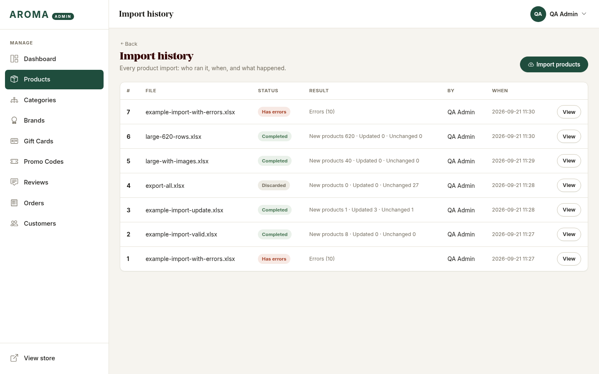

Open a run to see its errors and warnings again, or to download its error report. Runs older than 30 days are removed automatically.

---

## Fixing errors

| Message | What to do |
|---|---|
| **SKU is required on every row.** | Fill the SKU, or delete the empty row. |
| **Duplicate SKU — already used on row N of this file.** | Each SKU may appear once per file. Merge or remove one row. |
| **This SKU belongs to a deleted product.** | Restore that product from **Products → Trash**, or use another SKU. |
| **Product Name (Arabic) is required for a new product.** | New products need SKU, both names, Category and Price. |
| **Category “Shoes” was not found.** | Use a category name, ID or slug from the *Reference* sheet. Create the category first if it's new. |
| **More than one category is named “…”.** | Two categories share that name — use the ID instead. |
| **“about 100” is not a valid amount.** | Use a plain number: `100` or `100.50`. |
| **Sale Price must be lower than Price.** | Fix the two numbers, or leave Sale Price empty. |
| **“maybe” must be active or inactive.** / **must be yes or no.** | Use `active`/`inactive`, or `yes`/`no` (Arabic `نعم`/`لا` also works). |
| **“-3” must be a whole number, 0 or more.** | Stock can't be negative or fractional. |
| **This slug is already used by product …** | Choose another slug, or leave it empty to have one generated. |
| **Duplicate slug — already used on row N.** | Two rows share a slug; change one. |
| **The slug is not valid.** | Use letters, numbers and hyphens only. |
| **Too many image links (maximum 10 per product).** | Keep the 10 you need. |
| **Image could not be used: the host … is not a public address.** | The link points to a private or internal address. Use a public image URL. |
| **Image could not be used: the server answered with HTTP 404.** | The link is broken. Fix it, or tick *Import a product even if one of its image links fails*. |
| **Image could not be used: the link is not an image.** | The link opens a web page, not a picture. Right-click the picture → *Copy image address*. |
| **The sheet has no SKU column.** | Keep the template's header row. |
| **The file could not be read as an .xlsx workbook.** | Save it as *Excel Workbook (.xlsx)* — CSV and .xls aren't supported. |
| *Warning:* **Column “Notes” is not recognised and was ignored.** | Harmless: extra columns are skipped. |
| *Warning:* **This looks like a template example row.** | Delete the `EXAMPLE-` rows unless you want them. |

---

## FAQ

**Can I break my shop with a bad file?** No. The file is checked first, you review the result, and the import is all-or-nothing: if anything fails while saving, no product is changed.

**I confirmed by mistake — can I undo it?** There is no automatic undo. Export before a big import (**Export all products**) and keep that file as a backup: importing it again puts the previous values back (images that the import added stay, unless you tick *Replace product images*).

**Does importing my own export change anything?** No — it reports every product as *Unchanged*.

**Why were my images not added?** Check the run page for warnings. Without *Replace images*, images are only added, never removed.
Also make sure the links are public and end at a real picture.

**Can I import prices in another currency?** Prices are in SAR.

**Can I create categories or brands from the sheet?** No — create them first (Categories / Brands), then use their name or ID.

**Can I import variants (sizes, colours)?** Not yet; variants are managed on each product.

**The page says "Waiting in queue".** See [Large files](#large-files).

**Is the admin also available in Arabic?** Yes. Switch language as usual; the import pages, messages and the error report follow the language you uploaded in.

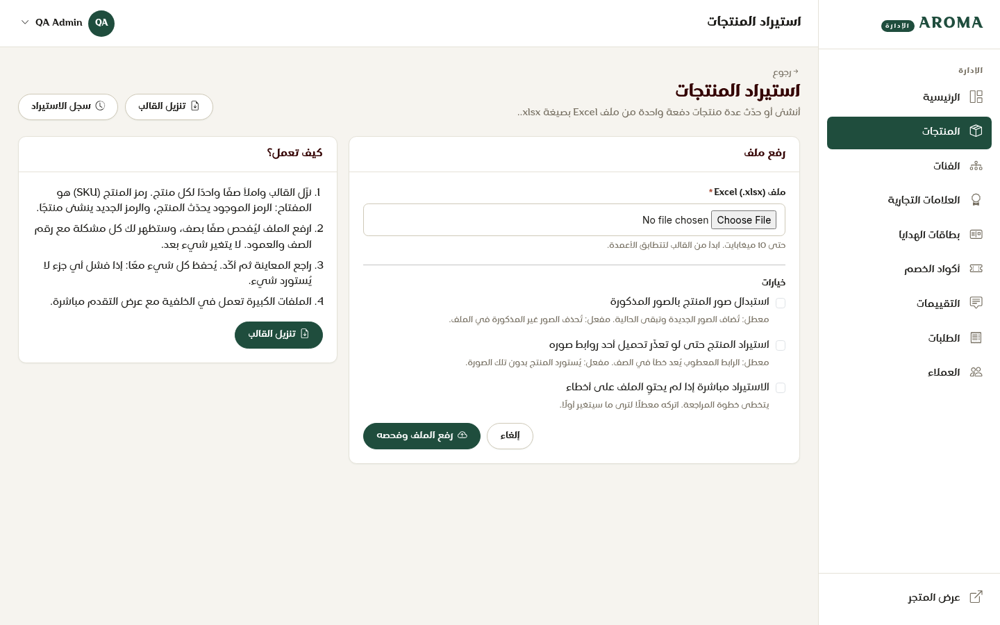

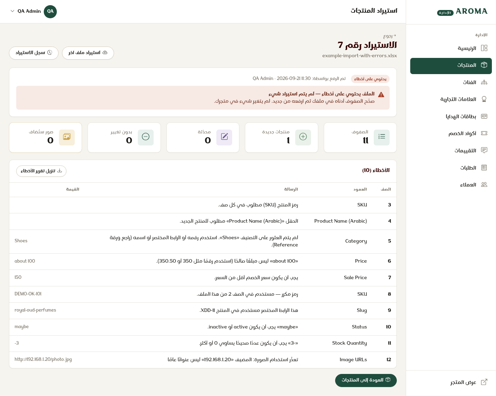

---

## Example files

All in [`examples/`](examples/). They use the shop's demo categories (*Perfumes, Abayas, Beauty, Accessories, Flowers & Gifts*) and public placeholder images.

| File | What it shows | Try it |
|---|---|---|
| [`product-import-template.xlsx`](examples/product-import-template.xlsx) | The template exactly as the **Download template** button gives it (3 sheets). | Fill it in. |
| [`example-import-valid.xlsx`](examples/example-import-valid.xlsx) | 8 bilingual products with SEO fields, sale prices, images, and the category written 4 different ways (name, Arabic name, ID, slug). | Import it: 8 new products. |
| [`example-import-update.xlsx`](examples/example-import-update.xlsx) | Updating by SKU: change a price and stock, change only stock, `[clear]` a sale, an untouched row, plus one new product. | Import it *after* the file above: 1 new, 3 updated, 1 unchanged. |
| [`example-import-with-errors.xlsx`](examples/example-import-with-errors.xlsx) | Ten different mistakes in one file. | Upload it to see the row-by-row report (nothing is imported). |
| [`example-export.xlsx`](examples/example-export.xlsx) | What **Export** produces (the products above, after the update). | Compare it with the template. |

*The `example-import-with-errors.xlsx` slug error refers to a product that exists in the demo data; on your own shop that particular row may pass.*

